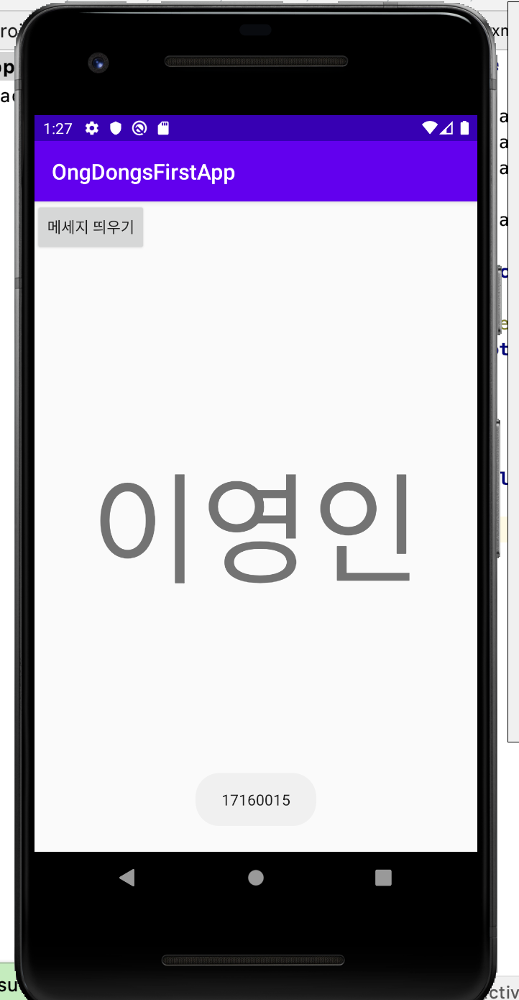
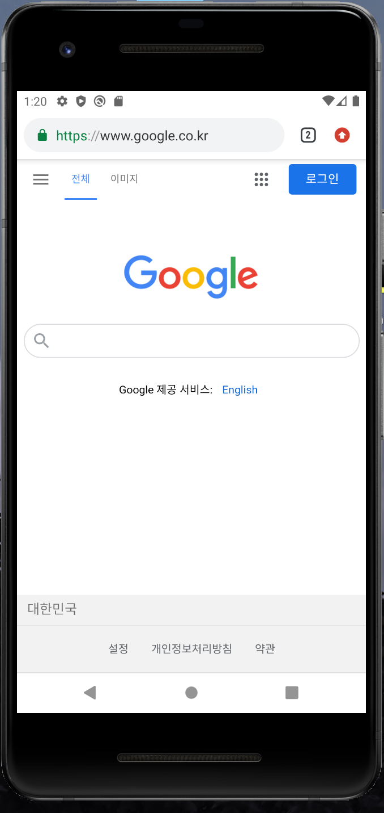
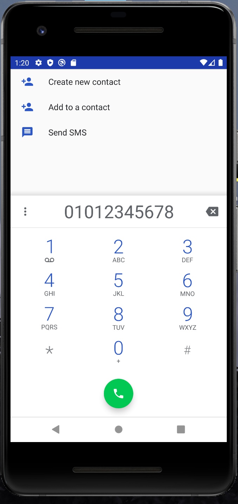
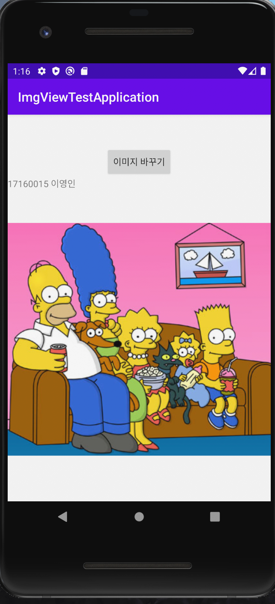
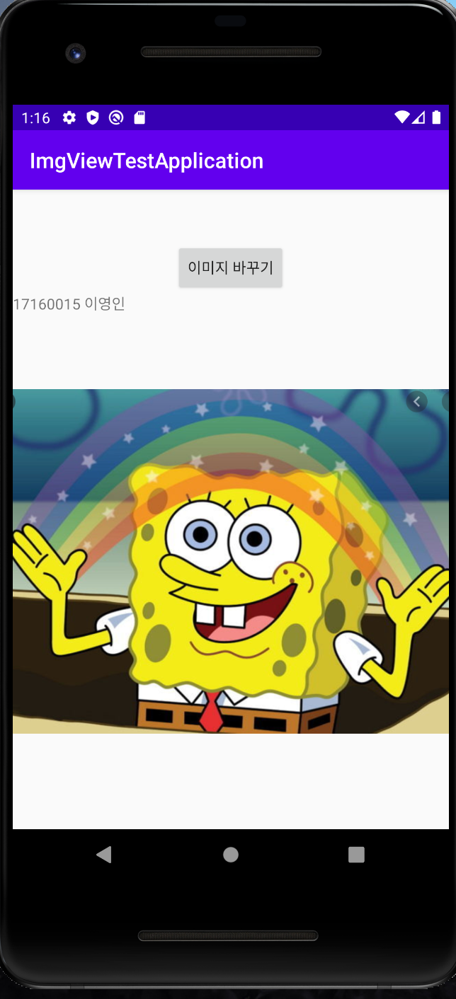
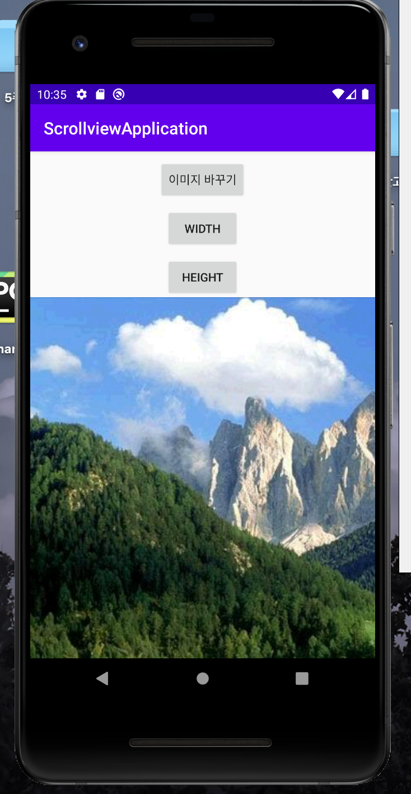
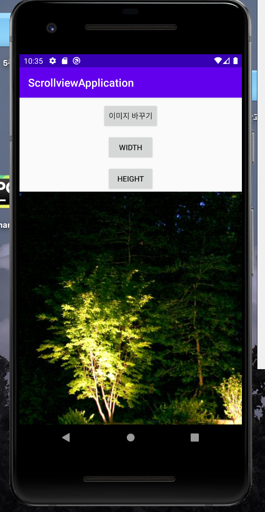
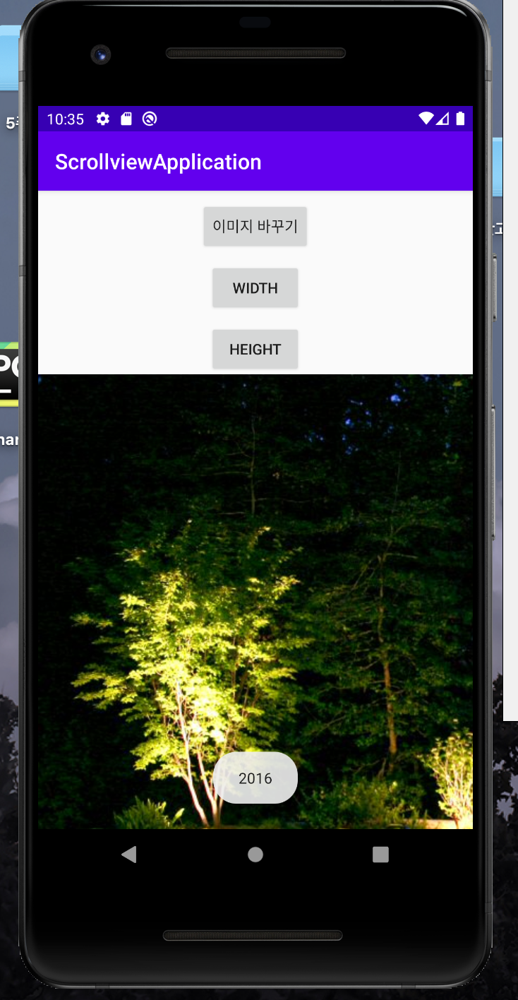
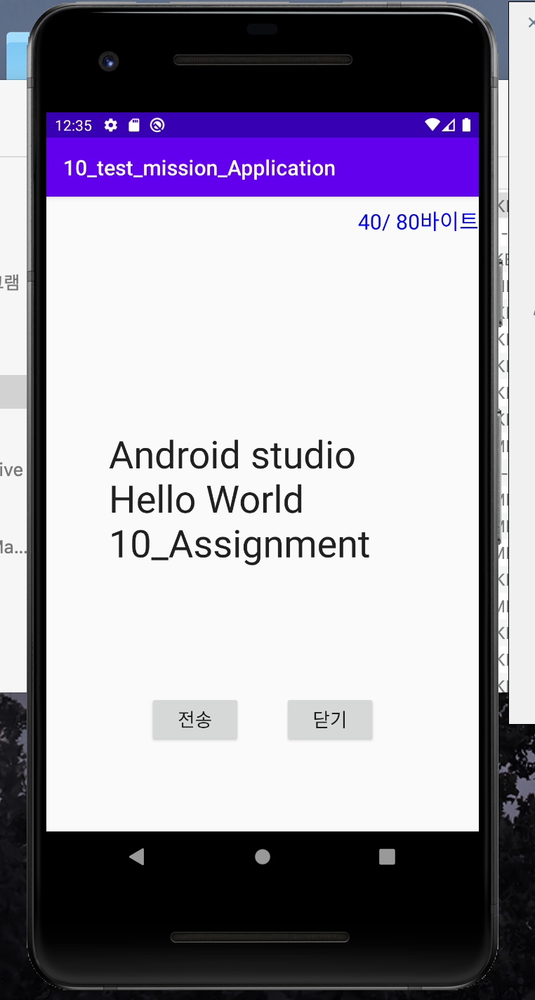

# 17160015 이영인

## 1주차 과제

## 2주차 과제
   </img>
## 3주차 과제
   </img>
  
   </img>
   
   
## 4주차 과제
   아이디어 명 : 하루일과를 마무리 할 수 있는 일기쓰는 앱
   -> 일기를 쓰기는 귀찮지만 자신의 하루일과를 정리하고 싶은 사람들이 이용할 수 있는 앱이다.
   사용자가 지정한 시간대에 알림을 보내 앱에 들어오는 것을 기억 할 수 있게 한다. 앱에서 할 수 있는 기능은 to-do리스트, 일기쓰는 칸, 사진 첨부 등이있다.
   일기를 쓰기위해 다이어리를 살 필요도 없고 꾸며야 된다는 강박관념 없이 심플하고 간결하게 그 날 있었던 일을 정리 할 수 있다. 자칫하면 잊어버릴 수 있는 일기를 
   처음 앱을 깔고 세팅을 할 때에 자신이 정한 시간대에 알림을 받아 하루 건너뛰려고 앱에 들어가지 않으면 일기가 밀렸다는 알림이 가게 하여 찝찝함에 짧게라도 쓰려는 마음이 들어서
   매일 하루를 기록하게 하는것이 목표이다. 그러다보면 쓰는 것에 익숙해져서 매일 하루를 기록하게되고 시간이 지나면 꾸준하게 해냈다는 사실에 뿌듯함이 느껴질 것 이다. 

## 7주차 과제
   </img>
   
   </img>
   

## 9주차 과제
   </img>
   
   </img>
   
   </img>
   
   </img>
   
   
## 10주차 과제
   </img>
